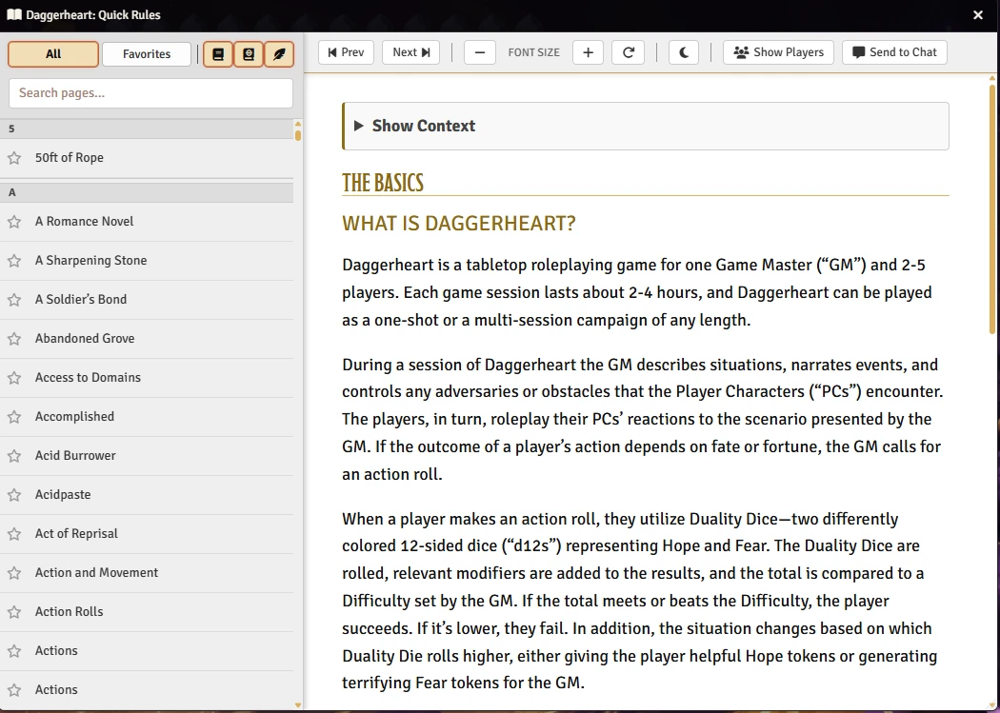
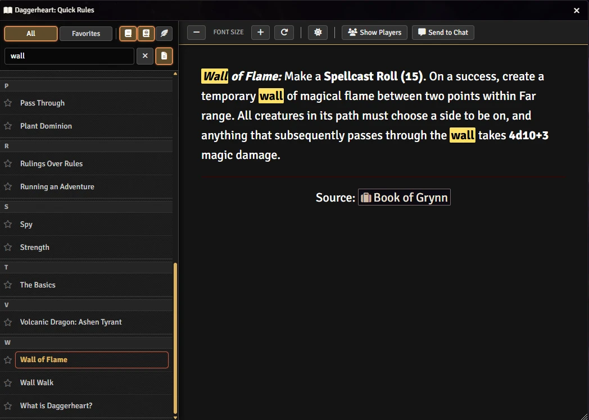
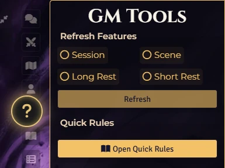

# 📜 Daggerheart: Quick Rules 📜

<p align="center"></p>

**Instant Rule Reference for Foundry VTT**

<p align="center"></p>

<p align="center"></p>

Access the Daggerheart rules and your own custom notes instantly without cluttering your screen.

## 🌟 Overview & Features

### ⚡ Instant Access

* **Floating Button:** A draggable `?` button stays on your canvas for one-click access.

* **Keyboard Shortcut:** Press `Shift + D` to toggle the window instantly.

* **Sidebar Integration:** Adds a convenient "Open Guide" button to the Daggerheart System Menu.

<p align="center"></p>

### 📖 Enhanced Reading Experience

* **🔍 Search & Filter:** Instantly find rules, terms, or mechanics by typing.

* **⭐ Favorites:** Pin your most-referenced rules to a dedicated tab for quick lookup.

* **👁️ Adjustable Text:** Increase or decrease font size on the fly for better readability.

### 🛠️ Customization

* **Custom Content:** GMs can create a folder named `📜 Custom Quick Rules` to add house rules or lore that players can browse.

* **Smart Permissions:** Only shows content users have permission to see.

## ⚙️ Usage

### Opening the Rules

1. Press **Shift + D** on your keyboard.

2. Click the **Floating `?` Button** on your screen.

3. Or go to the **Daggerheart Menu** (Sidebar) and click **Open Guide**.

4. You can also use a macro `QuickRules.Open();`. 

<p align="center"></p>

### Managing Content

* **Search:** Type in the top bar to filter the list.

* **Favorite:** Click the star icon (☆) next to any page to add it to your Favorites tab.

* **Share:** Click the "Share" button inside an entry to post it to the Chat.

## 🚀 Installation

Install via the Foundry VTT Module browser or use this manifest link:

```js
https://raw.githubusercontent.com/brunocalado/daggerheart-quickrules/main/module.json
```

## ⚖️ Credits

* **License:** MIT License.

* **Assets:** AI Audio and images provided are [CC0 1.0 Universal Public Domain](https://creativecommons.org/publicdomain/zero/1.0/).

**Disclaimer:** This module is an independent creation and is not affiliated with Darrington Press.
