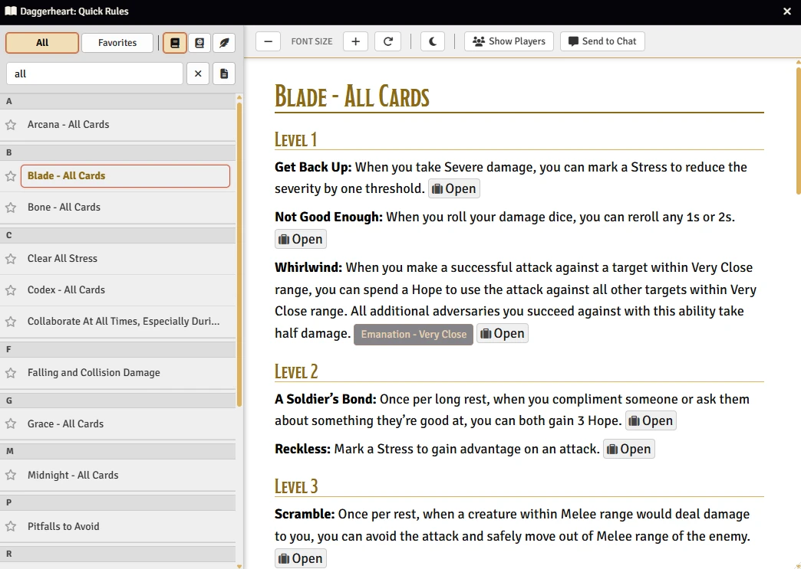
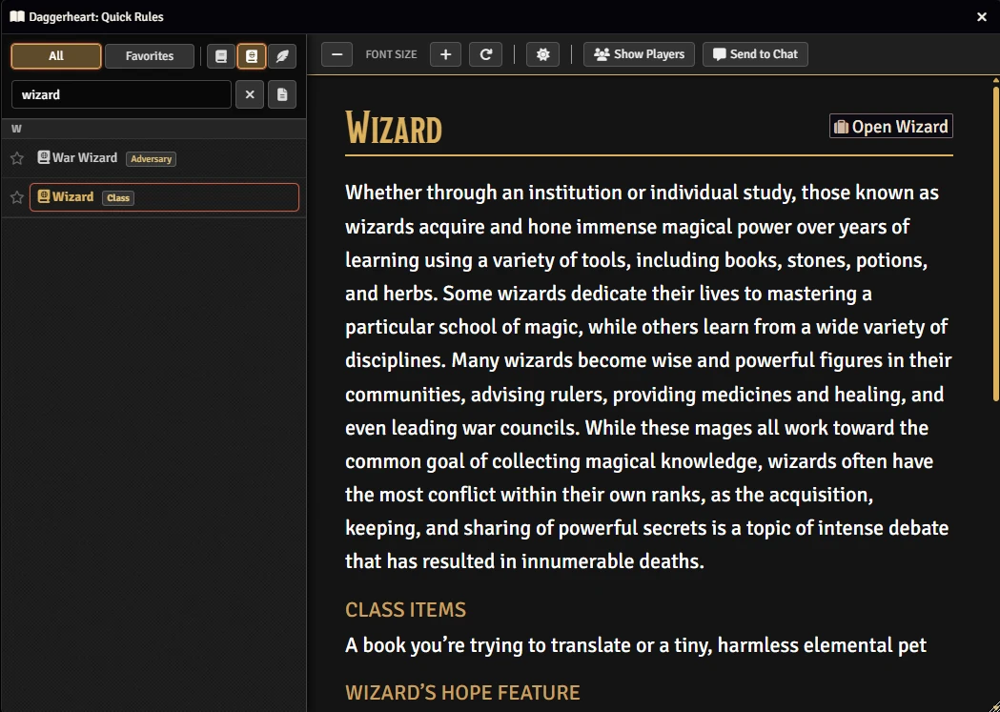
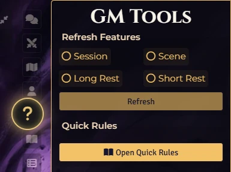

# 📜 Daggerheart: Quick Rules 📜

**Instant Rule Reference for Foundry VTT**

<p align="center"></p>

<p align="center"></p>

Access the Daggerheart rules and your own custom notes instantly without cluttering your screen.


[](https://buymeacoffee.com/mestredigital) [](https://mestredigital.online/pages/projetos-en)

## 🌟 Overview & Features

### ⚡ Instant Access

* **Floating Button:** A draggable `?` button stays on your canvas for one-click access.

* **Keyboard Shortcut:** Press `Shift + D` to toggle the window instantly.

* **Sidebar Integration:** Adds a convenient "Open Quick Rules" button to the Daggerheart System Menu.

<p align="center"></p>

### 📖 Enhanced Reading Experience

* **🔍 Search & Filter:** Instantly find rules, terms, or mechanics by typing.

* **⭐ Favorites:** Pin your most-referenced rules to a dedicated tab for quick lookup.

* **👁️ Adjustable Text:** Increase or decrease font size on the fly for better readability.

### 🛠️ Customization

* **Custom Content:** GMs can create a folder named `📜 Custom Quick Rules` to add house rules or lore that players can browse.

* **Smart Permissions:** Only shows content users have permission to see.

You can learn more at [How to Add Your Content
](https://github.com/brunocalado/daggerheart-quickrules/wiki/How-to-Add-Your-Content)

## ⚙️ Usage

### Opening the Rules

1. Press **Shift + D** on your keyboard.

2. Click the **Floating `?` Button** on your screen.

3. Or go to the **Daggerheart Menu** (Sidebar) and click **Open Quick Rules**.

4. You can also use a macro `QuickRules.Open();`. 

<p align="center"></p>

### Managing Content

* **Search:** Type in the top bar to filter the list.

* **Deep Search:** Toggle to search within titles or throughout the entire text.

* **Favorite:** Click the star icon (☆) next to any page to add it to your Favorites tab.

* **Share:** Click the "Share" button inside an entry to post it to the Chat.

## 🚀 Installation

Install via the Foundry VTT Module browser or use this manifest link:

```js
https://raw.githubusercontent.com/brunocalado/daggerheart-quickrules/main/module.json
```

## ⚖️ Credits

* **Code License:** GNU GPLv3.

**Disclaimer:** This module is an independent creation and is not affiliated with Darrington Press. This product includes materials from the Daggerheart System Reference Document 1.0, Critical Role, LLC. under the terms of the Darrington Press Community Gaming (DPCGL) License. More information can be found at [https://www.daggerheart.com](https://www.daggerheart.com).

# 🧰 My Daggerheart Modules

| Module | Description |
| :--- | :--- |
| 💀 [**Adversary Manager**](https://github.com/brunocalado/daggerheart-advmanager) | Scale adversaries instantly and build balanced encounters in Foundry VTT. |
| 🌟 [**Best Modules**](https://github.com/brunocalado/dh-best-modules) | A curated collection of essential modules to enhance the Daggerheart experience. |
| 🐉 [**Colossus**](https://github.com/brunocalado/dh-colossus) | Manage massive multi-part boss encounters with independent HP per part and a single shared stress pool. |
| 💥 [**Critical**](https://github.com/brunocalado/daggerheart-critical) | Animated Critical. |
| 💠 [**Custom Stat Tracker**](https://github.com/brunocalado/dh-new-stat-tracker) | Add custom trackers to actors. |
| ☠️ [**Death Moves**](https://github.com/brunocalado/daggerheart-death-moves) | Enhances the Death Move moment with a dramatic interface and full automation. |
| 📏 [**Distances**](https://github.com/brunocalado/daggerheart-distances) | Visualizes combat ranges with customizable rings and hover calculations. |
| 📦 [**Extra Content**](https://github.com/brunocalado/daggerheart-extra-content) | Homebrew for Daggerheart. |
| 🤖 [**Resource Macros**](https://github.com/brunocalado/daggerheart-fear-macros) | Automatically executes macros when the Fear or Hope resources are changed. |
| 😱 [**Fear Tracker**](https://github.com/brunocalado/daggerheart-fear-tracker) | Adds an animated slider bar with configurable fear tokens to the UI. |
| 🧟 [**Horde**](https://github.com/brunocalado/dh-horde) | Explode single horde tokens into dozens of individual tokens and manage their movement and stats automatically. |
| 🎁 [**Mystery Box**](https://github.com/brunocalado/dh-mystery-box) | Introduces mystery box mechanics for random loot and surprises. |
| ⚡ [**Quick Actions**](https://github.com/brunocalado/daggerheart-quickactions) | Quick access to common mechanics like Falling Damage, Downtime, etc. |
| 📜 [**Quick Rules**](https://github.com/brunocalado/daggerheart-quickrules) | Fast and accessible reference guide for the core rules. |
| 🎲 [**Stats**](https://github.com/brunocalado/daggerheart-stats) | Tracks dice rolls from GM and Players. |
| 🧠 [**Stats Toolbox**](https://github.com/brunocalado/dh-statblock-importer) | Import using a statblock. |
| 🛒 [**Store**](https://github.com/brunocalado/daggerheart-store) | A dynamic, interactive, and fully configurable store for Foundry VTT. |
| 🔍 [**Unidentified**](https://github.com/brunocalado/dh-unidentified) | Obfuscates item names and descriptions until they are identified by the players. |

# 🗺️ Adventures

| Adventure | Description |
| :--- | :--- |
| ✨ [**I Wish**](https://github.com/brunocalado/i-wish-daggerheart-adventure) | A wealthy merchant is cursed; one final expedition may be the only hope. |
| 💣 [**Suicide Squad**](https://github.com/brunocalado/suicide-squad-daggerheart-adventure) | Criminals forced to serve a ruthless master in a land on the brink of war. |